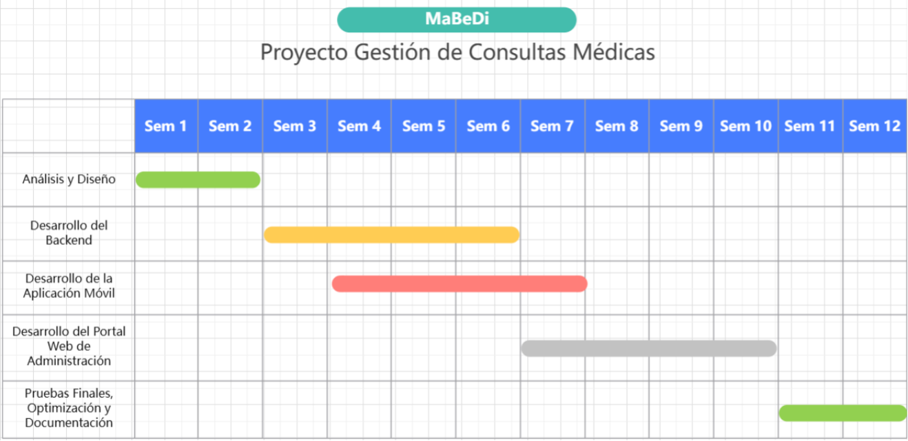

# 🏥 Sistema de Gestión de Consultas Médicas - Proyecto DAM

Este proyecto tiene como objetivo el desarrollo de una **solución multiplataforma** para la **gestión de consultas médicas**, compuesta por:

- 🧑‍⚕️ Un **portal web** para doctores y administradores.
- 📱 Una **aplicación móvil Android** para pacientes.
- 🔗 Un **backend en ASP.NET Core** con una API RESTful centralizada y segura.

## 📌 Objetivos

- Desarrollar una solución digital para mejorar la gestión de consultas médicas en centros de salud.
- Facilitar a los **pacientes** la reserva, modificación y cancelación de citas médicas.
- Permitir a los **médicos** gestionar sus agendas y pacientes.
- Ofrecer a los **administradores** una plataforma completa de gestión de usuarios, citas y horarios.
- Conectar todas las plataformas mediante una API robusta y segura.

## 🚀 Tecnologías Utilizadas

| Plataforma       | Tecnologías                                       |
|------------------|---------------------------------------------------|
| Backend/API      | ASP.NET Core, Entity Framework Core, SQL Server   |
| App Móvil        | Kotlin                                            |
| Portal Web       | React.js, TypeScript                              |
| Infraestructura  | Vercel/Render (opcional para despliegue)          |

## 👥 Usuarios y Funcionalidades

### 🧑 Paciente (App Móvil)
- Registro e inicio de sesión
- Visualización de citas disponibles
- Notificaciones básicas

### 👨‍⚕️ Doctor (Portal Web)
- Visualización de sus propios pacientes y citas
- Gestión de su agenda y disponibilidad
- Creación de citas exclusivamente con sus pacientes

### 🧑‍💼 Administrador (Portal Web)
- Gestión global de pacientes, doctores y citas
- CRUD de horarios, usuarios y servicios
- Panel de control y administración completa

## 📅 Alcance y Planificación

- Período estimado: **3 meses**
- Planificación mediante diagrama de Gantt
- Metodología iterativa para desarrollo y validación

## 🧠 Justificación

Este sistema nace como solución ante la necesidad de modernizar la atención médica, reducir tiempos de espera, evitar confusiones administrativas y acercar la salud digital a los pacientes y profesionales sanitarios. Se alinea con iniciativas actuales de digitalización del sector salud.

